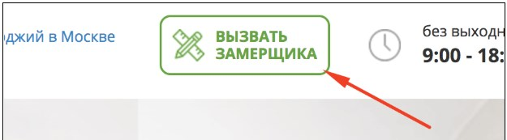
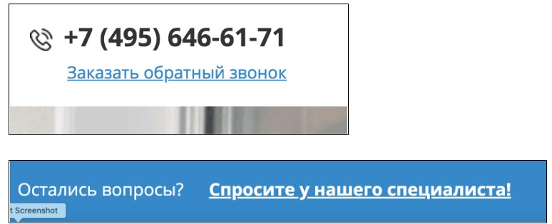
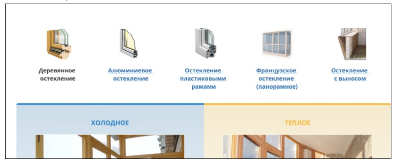

1. При клике на кнопку "Вызвать замерщика" должно вызываться модальное окно (класс popup_engineer), при клике на крестик исчезать.
 
2. При клике на надписи "Заказать обратный звонок" и "Спросите у нашего специалиста" должно вызываться модальное окно (класс popup), 
при клике на крестик исчезать. 
 
3. Должны быть реализованы табы. Так же идет переключение активного таба и его стиля (класс active), пользователь может кликнуть
и на надпись и на картинку.
 
4. Реализация табов. Так же идет переключение активного таба и его стиля (класс after_click).
5. Если пользователь на странице больше 60 секунд - должно появится модальное окно (popup). При нажатии на крестик окно исчезает.
(для теста выставлено 5 секунд)
